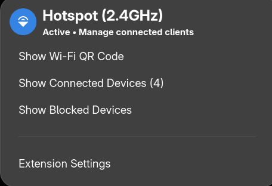
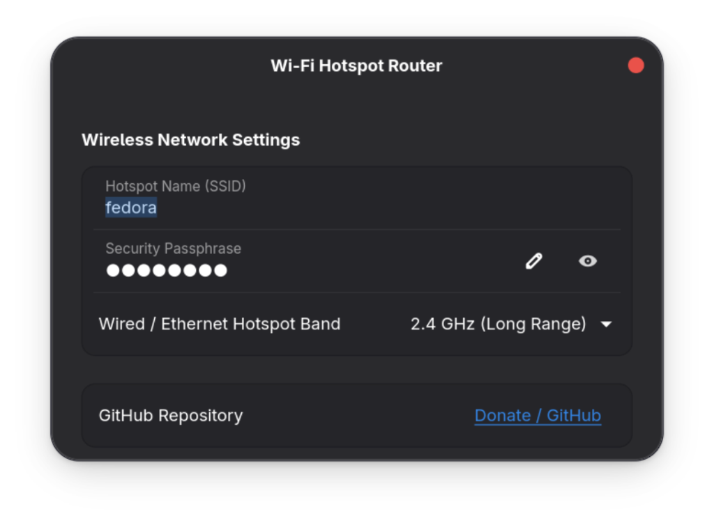

# Wi-Fi Hotspot Router

A GNOME Shell extension for simultaneous Wi-Fi hotspot sharing and client connectivity (AP + STA repeater mode) on a single Wi-Fi adapter.




## Features

- **Wi-Fi Repeater Mode**: Share internet from Wi-Fi without disconnecting from your upstream Wi-Fi network.
- **Spectrum Auto-Detection**: Automatically selects optimal 2.4GHz and 5GHz channel capabilities (HT40 / VHT80).
- **QR Code Sharing**: Dynamic Wi-Fi QR code generation for quick mobile device connections.
- **Client Management**: Monitor and block/unblock connected devices in real time.

## Installation

```bash
git clone https://github.com/Pardhu0547s/wifi-hotspot-router.git
cd wifi-hotspot-router
./setup.sh
```

Enable the extension:
```bash
gnome-extensions enable wifi-hotspot-router@pardhu0547s.github.com
```
*Note: Restart GNOME Shell or re-login after installation to load the schema.*

## Requirements

- GNOME Shell 42+
- `create_ap` (`linux-wifi-hotspot`)
- `hostapd`, `dnsmasq`, `iw`, `iptables`, `iproute2`, `qrencode`, `polkit`

## License & Support

[GitHub Repository & Support](https://github.com/Pardhu0547s/wifi-hotspot-router)
